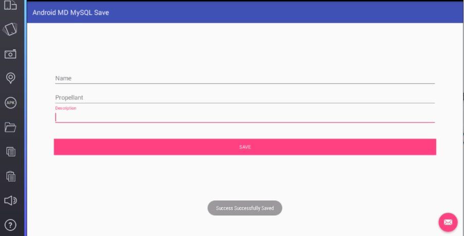

# AndroidMDMySQLSave
Android MySQL : How to save into multiple columns in MySQL database.

* Connect to MySQL from android app.
* We have to use a serverside language in this case PHP.
* We make a HTTP POST to the server.

* The table Structure :

*Save data from Material EditTexts.

Oclemy,Cheers.
